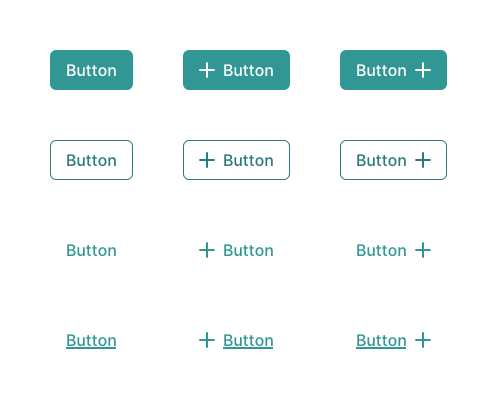

  
  
  <h1>Chakra UI for Sketch</h1>

## Screenshots

### Colors

### Shadows

### Buttons

## Maintainers

Chakra UI for Sketch is designed, developed and maintained by [@barad](https://twitter.com/barad)

## Inspired by

- [Chakra UI by Segun Adebayo](https://chakra-ui.com)
- [Chakra UI for Figma by Moove It Design](https://www.figma.com/community/file/840198843830316310)
- [Chakra UI for Figma by Javier Alaves](https://www.figma.com/file/cWuIe1XzqLAKnBcLu9WmDy/Chakra-UI)
- [Tailwind CSS for Sketch by jessedobbelaere](https://github.com/jessedobbelaere/tailwindcss-sketch-kit)
- [Tailwind CSS for Figma by impulse](https://github.com/impulse/tailwindcss-figma-kit)

## License

[MIT](LICENSE)

⚡️💎

